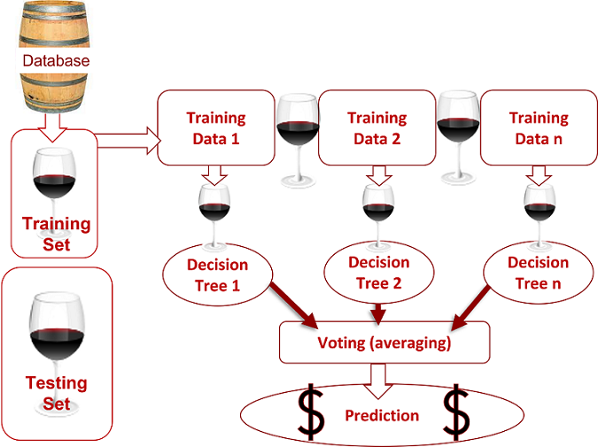

# Wine Enthusiasts Winery

  

## Table of Contents
* [Overview](https://github.com/rkaysen63/Wine_Enthusiasts/blob/master/README.md#overview)
* [Setup](https://github.com/rkaysen63/Wine_Enthusiasts/blob/master/README.md#setup)
* [Machine Learning Model](https://github.com/rkaysen63/Wine_Enthusiasts/blob/master/README.md#machine-learning-model)
* [Description of Database](https://github.com/rkaysen63/Wine_Enthusiasts/blob/master/README.md#description-of-database)
* [Process](https://github.com/rkaysen63/Wine_Enthusiasts/blob/master/README.md#process)
* [Presentation](https://github.com/rkaysen63/Wine_Enthusiasts/blob/master/README.md#Presentation)
* [Results](https://github.com/rkaysen63/Wine_Enthusiasts/blob/master/README.md#results)

## Overview
### Description
This project is reviewing wine data for trends. Due to the large volume of data available, we will be using various data analysis techniques to analyze the data and will provide visualizations to make the data easy to understand.
### Background
Some executives from Wine Enthusiast magazine have decided to start a winery. They know the world of wine and are confident they can create a great wine. But it's a wide world so the challenge is deciding where to start. They understand the existing wines and wineries but aren't sure how best to fit into the wine market. They contacted us for help making determinations about what varietals to start with, what they can charge, and even what location to consider for their winery.

## Setup
### Description of source data
To begin assessing the project, we used initial data from Wine Enthusiast magazine. This data was originally scraped from Wine Enthusiast using a web scraper. For our purposes, we started with a verified and corrected data set of Wine Enthusiast data available on Kaggle.

This initial data contains basic details of wines:
* Wine identification detail: designation, varietal, winery
* Evaluation details: price, points, reviewer information
* Location: province, country 

### Data focus
#### Points
Ratings of the wine are given in points on a 100-point scale. Scores are determined on both production quality and how well the wine fits the varietal and region. Wine Enthusiast magazine reviews wines with scores above 80 points. Due to the brand recognition of the Wine Enthusiasts, the winery will only produce very high quality wine, 90 points or more. 

#### Price
Similarly, the Wine Enthusiast winery will be a high-end destination winery. The price point will be high by design, as the execs intend to build a winery and need to pay for it! One of the main questions they want to answer from the data is what price range they should set for their initial offerings. They know from their industry background what existing wineries can charge for a new wine, but they need help understanding what price category they should include in their budget. 

#### Location
The Wine Enthusiasts know the US wine market and most of the partners already live in the US. For these reasons, their initial focus is the United States. However, the partners plan to move where they start the winery. They hope that the data analysis will help them decide where to begin their location search.

### Machine Learning Model

#### Preliminary feature selection and engineering 
  * Remove non-US data for initial review
  * Remove reviewer columns (taster name and twitter handle)
  * Drop "designation" (alternate version of name, often missing)
  * Adjust region data (Pull Province to region field(s) where empty. Necessary for machine learning)
  * Drop rows with empty values (Small reduction necessary for clean data)

#### Preliminary data processing
* Review data
  * Review unique values for potential target data
  * Take value counts to confirm expected issues in data
    * Confirmed that using location as a machine learning feature might create an imbalanced model.
        * US wines outnumber other countries in the Wine Enthusiast ratings
        * California wines outnumber other US states as well
  * Review, create, and edit features used in model
    * Visualize the value counts of variety
    * Review data to determine which values to combine as Other. (Necessary for machine learning model)
        * Per the plot, initial value caused some mainstream varieties to be binned in "other", so we lowered the threshold for "other" to 300 wines in that variety.
* Prepare the data for processing 
  * Create columns to hold machine learning data results
  * Encode data using OneHotEncoder, fit and transform the data (adjust values to variables for use by machine learning model)
  * Adjust the working dataset to contain only fields used by machine learning model
* Prepare for machine learning 
    * Split preprocessed data into our features (examined) and target (results) arrays
    * Split the preprocessed data into a training and testing dataset
    * Scale the dataset to set values on a consistent scale across columns for even evaluation
    * Fit the data and run initial evaluations

#### Machine Learning model choice
* Models considered
    * Easy Ensemble Classifier (EEC) 
    * Random Forest Classifier (RFC)
* Models chosen: RFC
    * Advantages
        * robust against overfitting as the weak learners are trained on different pieces of the data.
        * can be used to rank the importance of input variables in a natural way.
        * can handle thousands of input variables without variable deletion.
        * robust to outliers and nonlinear data.
        * runs efficiently on large datasets.
    * Limitations
        * requires significant computational power to build multiple trees and combine their ouputs.
        * requires additional time for training multiple trees in order to make determination.
        * can limit interpretability and does not clarify significance of each variable
    * In Testing, RFC outperformed the EEC.
        * We ran both models ten times, and the results for both were consistent and reproducible with accuracy scores staying around 0.6028 for the RFC and 0.3979 for the EEC.
        * The RFC ran on average five seconds faster than the EEC. 

#### Training the Machine Learning model 
* We defined the features set using points and variety, and we define the target set by binning the prices of the wines into a column called price bins.  
* We split the data into training (75%) and testing sets (25%). The ratio is a common standard that allows training without overfitting while leaving a large enough data set for training.
* We created the StandardScaler instance, fit the scaler with the training set, and scaled the data. 
* Before we fit the random forest model to our X_train_scaled and y_train training data, we created a random forest instance using the random forest classifier, RandomForestClassifier() using two parameters:  the number of trees created by the algorithm> (n_estimators=500) and a random_state=1 parameters.
    * Generally, the higher number makes the predictions stronger and more stable but can slow down the output because of the higher training time allocated. 
* We then fit the model with our training sets and made predictions with the scaled testing set.
* After making predictions on the scaled testing data, we analyze how well our random forest model classifies price bins by creating a Classification report that gives measures of success in several areas: Accuracy, Precision, Recall, and F1-Scores.
#### Interpreting the Machine Learning model 
* We were able to fit the model appropriately  so we are confident in the accuracy measurements.
* Our main interest was Precision but all success measures were good for wines in the moderately expensive category ($60 and under).
* We think our model is a good predictor for wines in the moderately expensive category. Since that category will suit a broader market, we think Wine Enthusiast will be interested in that category over more extreme price categories for their initial offerings

  

      
      
  

### Description of Database 

* Database chosen: SQL via PGadmin
  * Reasons
    * Convenience: All team members have access to PG Admin
    * Future projects: Using Wine Enthusiast or other branded connection might limit our future use of the project for training or template purposes

  

* Wine data
  * The starting wine data was sourced from Kaggle. The data set contains wineries, regions, variety, title, points, price, and the description.

  

* Location table:
  * The location table is based off of data from the wine data set. Two google API’s, Place Search and Place IDs, are used to pull the latitude and longitude for each region using a for loop.

      
  

 
## Process

### Data Exploration Phase
* Wine data was reviewed for:
  * Usefulness in answering questions
  * Completeness
  * Clarity
  * Scope/amount of data

Once data had been reviewed, theories were discussed and a preliminary question and target was chosen. The location question was considered first but initial work suggested that answers might not be clear or robust enough. We decided that the bottom line of price was what could be inferred from the data. 

### Data Analysis Phase

Once the initial question was decided, machine learning was set up and tested for accuracy. Two working models using different algorithm classifiers were established. The data was fitted and each model trained. Accuracy was compared and the better performing model was kept and improved. 

### Tools Used

Description of tools used: Technologies, languages, tools, algos used
* Data: https://www.kaggle.com/zynicide/wine-reviews?select=winemag-data-130k-v2.csv
* Tools: 
  * Python (Libraries: pandas, matplotlib, hvplot.pandas, plotly.express, sklearn.preprocessing, sklearn.decomposition, sklearn.cluster)
  * Jupyter Notebook
  * PostgreSQL
  * pgAdmin
  * JavaScript
  * Google API
  * GitHub
  * Google Slides

  

### Presentation
Our client presentation will be in Google slides to go over our process and results. We will include screenshots of the material that we'll provide the client for their further research. This includes a dashboard and a wine finder.

## The Dashboard

The interactive dashboard gives clients an overview by elements.
Clients can filter within elements and see how other elements are affected.

Elements:
  * Model accuracy report
  * Average price per state
  * Type by price categories
  * Type by region
  * Wineries by region

## The Wine Finder

Filters include search by:
  * Province or state in the U.S.
  * Region – smaller areas within a province (state)
  * Winery
  * Variety – such as Pinot Noir, Chardonnay
  * Type – red, white, pink
  * Title – bottle label
  * Points – rating
  * Price
  * Description

Functionality:
  * Case does not matter.
  * Points entered returns points entered or higher.
  * Price entered returns amount entered plus or minus $5.
  * Multiple filters work together.
  * Navbar reset button.

### Results

* Observations:
  * Model accurately predicts moderately expensive wines ($60 and under).
  * Consistent and reproducible results with accuracy around 0.60
  * Precision was the main goal but other measures of accuracy were also good.

* Recommendation to Wine Enthusiast Magazine: 
The moderately expensive category will suit a broader market for Wine Enthusiast to offer for their initial production run.

### Recommendations

* Expand number of countries
* Analysis by vintage
* Competitor information added
* In-depth analysis on specific varieties
* Create a lean database to allow for a smaller database

### Lessons Learned
* Drink more wine
* Make the search descriptions by flavor
* Add partial search on varieties 

### Links
* Presentation (Google Slides)
https://docs.google.com/presentation/d/1al0KPFSLv92ESneYu9sNFrJILiIPfJE4JnmgMALsOQo/edit?usp=sharing

* Dashboard
https://public.tableau.com/app/profile/delia.davila/viz/WineEnthusiastDashboard_16283449356720/Dashboard1?publish=yes

* Wine Finder
https://rkaysen63.github.io/Wine_Enthusiasts/index.html

[Back to the Table of Contents](https://github.com/rkaysen63/Wine_Enthusiasts/blob/master/README.md#table-of-contents)

